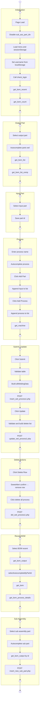

# Program Flow — sub_assembly.js (All Sections Stacked Vertically)

```mermaid
graph TB

%% invisible connectors to stack sections vertically
StartAll([ ]) --> InitStart
InitEnd --> OutStart
OutEnd --> InStart
InEnd --> ProcStart
ProcEnd --> SubmitStart
SubmitEnd --> DeleteStart
DeleteEnd --> BOMStart
BOMEnd --> SubStart
SubEnd --> EndAll([ ])

%% --- Initialization ---
subgraph Initialization
direction TB
  InitStart([ ]) --> Start[Page Load]
  Start --> Disable[Disable sub_ass_part_div]
  Disable --> LoadMenu[Load menu and sessionStorage]
  LoadMenu --> SetUser[Set username from localStorage]
  SetUser --> InitLogin[Call check_login]
  InitLogin --> GetRecent[get_bom_recent]
  GetRecent --> GetCount[get_bom_count]
  GetCount --> InitEnd([ ])
end

%% --- Output Part ---
subgraph Output Part
direction TB
  OutStart([ ]) --> UserOut[Select output part]
  UserOut --> AutoOut[Autocomplete parts wel]
  AutoOut --> BomList[get_bom_list]
  BomList --> BomComp[get_bom_list_comp]
  BomComp --> OutEnd([ ])
end

%% --- Input Part ---
subgraph Input Part
direction TB
  InStart([ ]) --> UserIn[Select input part]
  UserIn --> SaveIn[Save part id]
  SaveIn --> InEnd([ ])
end

%% --- Process ---
subgraph Process
direction TB
  ProcStart([ ]) --> Proc[Enter process name]
  Proc --> AutoProc[Autocomplete process]
  AutoProc --> AddPart[Click Add Part]
  AddPart --> AppendPart[Append input to list]
  AppendPart --> AddProc[Click Add Process]
  AddProc --> AppendProc[Append process to list]
  AppendProc --> GetMachine[get_machine]
  GetMachine --> ProcEnd([ ])
end

%% --- Submit / Update ---
subgraph Submit / Update
direction TB
  SubmitStart([ ]) --> Submit[Click Submit]
  Submit --> Validate1[Validate table]
  Validate1 --> BuildData[Build allWeldingData]
  BuildData --> Insert[POST insert_wel_process1.php]
  Insert --> Update[Click Update]
  Update --> Validate2[Validate and build delete list]
  Validate2 --> UpdatePHP[POST update_wel_process1.php]
  UpdatePHP --> SubmitEnd([ ])
end

%% --- Delete Actions ---
subgraph Delete Actions
direction TB
  DeleteStart([ ]) --> DeleteRow[Click Delete Row]
  DeleteRow --> ConfirmDel[SweetAlert confirm → remove row]
  ConfirmDel --> DeleteAll[Click delete all process]
  DeleteAll --> DelPHP[POST del_wel_process1.php]
  DelPHP --> DeleteEnd([ ])
end

%% --- Recent BOM ---
subgraph Recent BOM
direction TB
  BOMStart([ ]) --> BOMRecent[Select BOM recent]
  BOMRecent --> BOMOutput[get_bom_output]
  BOMOutput --> SelAuto[selectAutocompleteByPartId]
  SelAuto --> BomMain[get_bom]
  BomMain --> ProcessDetails[get_bom_process_details]
  ProcessDetails --> BOMEnd([ ])
end

%% --- Sub Assembly ---
subgraph Sub Assembly
direction TB
  SubStart([ ]) --> SubAss[Select sub assembly part]
  SubAss --> AutoSub[Autocomplete sub part]
  AutoSub --> GetOutput[get_bom_output by id]
  GetOutput --> AddSub[POST insert_new_sub_part.php]
  AddSub --> SubEnd([ ])
end
```
